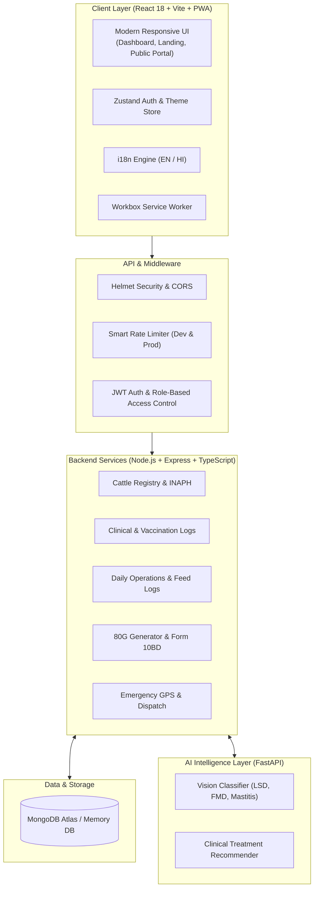

# 🐄 E-Gowshala — Next-Gen AI Smart Gaushala Platform & Emergency Rescue Network

<p align="center">
  
  
  
  
  
  
  
  
  
</p>

---

## 📌 Executive Summary

**E-Gowshala** is India's first end-to-end, enterprise-grade digital sanctuary management platform engineered for **Gaushalas (Cow Shelters), Animal Welfare NGOs, and State Animal Husbandry Departments**.

By marrying **Computer Vision AI Diagnostics**, **Emergency GPS Ambulance Dispatch**, **Automated Section 80G Tax-Deductible Donation Infrastructure**, and **Government Form 10BD CSR Compliance**, E-Gowshala transitions traditional shelters from pen-and-paper vulnerability into a high-transparency, tech-driven sanctuary network.

---

## 🌟 Key Highlights & Innovations

### 1. 🚨 Emergency Cattle Distress & GPS Ambulance Network
- **Instant Distress Reporting:** Direct public distress portal with mobile camera photo upload and HTML5 Geolocation capture.
- **Live Rescue Control Room:** Real-time dispatcher board with status tracking (`Pending` ➔ `Mobilized` ➔ `En Route` ➔ `Rescued`).
- **Interactive Rescue Radar:** Leaflet-powered GIS map displaying color-coded rescue incidents (Critical, Severe, Moderate) with one-click Google Maps navigation coordinates.

### 2. 🧠 AI Clinical Vision & Diagnostic Intelligence
- **Multimodal Disease Classifier:** Detects cattle afflictions (Lumpy Skin Disease, Foot & Mouth Disease, Mastitis, Blackleg, Dermatitis) with confidence percentages.
- **Instant Treatment Protocols:** Automated isolation advisory, dosage regimens, and antiseptic care instructions.
- **Veterinary Feedback Loop:** Resident veterinarians can confirm or amend AI diagnoses to continuously improve precision.

### 3. 🏷️ Smart QR Ear-Tag Registry & INAPH Alignment
- **Digital Heritage Profiles:** Complete records covering breed ancestry (Gir, Sahiwal, Tharparkar, Rathi, Kankrej, Red Sindhi), gender, birth date, lactation stage, and assigned sheds.
- **One-Scan Medical History:** Generates unique QR tags for ear-tags. Scanning via any mobile camera reveals instant clinical history and vaccination status.

### 4. 📋 Operations & Kanban Task Automation
- **Real-Time Kanban Board:** Drag-and-drop workflow tracking (`To Do`, `In Progress`, `Completed`) with priority flags.
- **Nutritional Feed Logging:** Daily ration accounting tracking dry fodder, green silage, cattle feed concentrates, and mineral supplements.
- **Caretaker Attendance Matrix:** Shift monitoring with check-in, check-out, and shift logs.

### 5. 💰 Automated Section 80G Receipts & Form 10BD CSR Compliance
- **Instant 80G PDF Generation:** Automated tax exemption certificates formatted to Indian Income Tax Department guidelines.
- **Annual Form 10BD Export:** 1-click CSV and printable audit statements for corporate CSR filings under Section 80G(5)(viii).
- **Cow Sponsorship & Adoption:** Recurring monthly donor adoption matching with dedicated certificates and progress logs.

### 6. 🖼️ Public "Adopt-a-Cow" Wall of Gratitude
- Public memorial and adoption tribute wall highlighting donors, sponsored sacred cows, and personalized blessing dedications.

### 7. 🌐 Bilingual (English / हिन्दी) & Curved-Screen Responsive PWA
- **Instant Language Switching:** Fully localized interface in English and Hindi.
- **Universal Multi-Device Layout:** Flawless rendering on desktop, tablets, and curved-screen smartphones (`viewport-fit=cover` & safe-area insets).
- **Progressive Web App (PWA):** Service worker offline caching via Workbox for field caretakers with low connectivity.

---

## 🏗️ System Architecture



---

## 💻 Tech Stack

| Domain | Technology | Description |
|---|---|---|
| **Frontend Framework** | React 18.3 + TypeScript | Reactive component architecture |
| **Styling & Design** | Vanilla CSS Tokens + Tailwind | Fluid glassmorphism, responsive grid utilities |
| **Icons & Charts** | Lucide React + Recharts | High-performance dashboard analytics |
| **Maps & GIS** | Leaflet + React Leaflet | Interactive live emergency rescue radar |
| **State Management** | Zustand | Lightweight persistent auth & theme store |
| **Offline & PWA** | Vite PWA Plugin + Workbox | Offline-first service worker precaching |
| **Backend Core** | Node.js + Express + TypeScript | Modular, scalable REST API architecture |
| **Database & ODM** | MongoDB + Mongoose | Schema-enforced document storage with in-memory fallback |
| **Security** | Helmet, bcryptjs, JWT, Rate-Limit | Enterprise RBAC with 6 permission tiers |
| **Document Generation**| PDFKit | Cryptographically verified 80G tax certificates |
| **AI Microservice** | Python 3.10 + FastAPI + Uvicorn | High-throughput computer vision inference |

---

## 🚀 Quick Start Guide

### ⚡ 1-Click Launch (All Services)

Clone the repository and run the root start command:

```bash
# Clone repository
git clone https://github.com/Rahul-70669/E-Gowshala.git
cd E-Gowshala

# Install dependencies (root, client, server)
npm run install:all

# Start Backend, AI Service, and Frontend concurrently
npm start
```

Once running, access:
- 🖥️ **Web Application:** [`http://localhost:5173`](http://localhost:5173)
- ⚙️ **REST API Server:** [`http://localhost:5000`](http://localhost:5000)
- 🤖 **AI Microservice:** [`http://localhost:8000`](http://localhost:8000)
- 📖 **AI OpenAPI Docs:** [`http://localhost:8000/docs`](http://localhost:8000/docs)

---

## 🔑 Pre-Configured Test Accounts

The platform includes an automated database seeder populating **20+ Indian indigenous cattle records**, veterinary health files, daily operations, donations, and 6 role accounts:

| Role | Email | Password | Access Privileges |
|---|---|---|---|
| 👑 **Administrator** | `admin@egowshala.org` | `admin123` | Unrestricted platform control, Form 10BD audit export, user management |
| 🩺 **Veterinarian** | `vet@egowshala.org` | `admin123` | Medical checkup logs, AI scan verification, vaccination scheduling |
| 🌾 **Caretaker** | `caretaker@egowshala.org` | `admin123` | Daily fodder/feed logging, task updates, cattle attendance |
| 🙏 **Donor / Adopter** | `donor@egowshala.org` | `admin123` | Personal donation ledger, instant 80G receipts, adoption sponsorships |
| 🚑 **Volunteer** | `volunteer@egowshala.org` | `admin123` | Emergency rescue triage, dispatch coordination, photo wall |
| 🏛️ **Government Auditor** | `govt@egowshala.org` | `admin123` | Read-only compliance auditing, welfare statistics, 80G certificates |

---

## 📁 Repository Directory Structure

```
E-Gowshala/
├── client/                     # React + Vite Frontend Application
│   ├── public/                 # Favicons, Web App Manifest, PWA icons
│   ├── src/
│   │   ├── components/         # Shared atomics, navigation, layout shells
│   │   ├── features/
│   │   │   ├── auth/           # Login & Multi-role Registration
│   │   │   ├── cows/           # Cattle Registry, Profile, QR Tagging, Rescue
│   │   │   ├── dashboard/      # Executive Dashboard Home & Metric Cards
│   │   │   ├── donations/      # 80G Tax Certificates, Donor Management, Adoptions
│   │   │   ├── finance/        # Ledger, Expense Categories, Trend Visualizations
│   │   │   ├── health/         # Veterinary Checkups, AI Vision Scans, Vaccines
│   │   │   ├── home/           # Public Landing Page with Live Impact Highlights
│   │   │   ├── impact/         # Live Impact Analytics & Public Photo Wall
│   │   │   ├── operations/     # Daily Operations, Kanban Board, Fodder Logs
│   │   │   └── visitors/       # Visitor Schedule, Guest Check-In/Out
│   │   ├── lib/                # API client with interceptors, i18n dictionary
│   │   ├── store/              # Zustand authentication and global store
│   │   └── index.css           # Design tokens, curved-screen safe insets, themes
│   └── vite.config.ts          # Vite build, PWA manifest, and dev server config
├── server/                     # Node.js + Express Backend API
│   ├── src/
│   │   ├── config/             # Environment schemas, database connection
│   │   ├── middleware/         # JWT verification, RBAC, rate-limiting, error handler
│   │   ├── modules/            # Micro-modular controller, service, and routes:
│   │   │   ├── auth/           # Authentication & token renewal
│   │   │   ├── cow/            # Cattle inventory & QR generation
│   │   │   ├── donation/       # Contributions & 80G PDF streaming
│   │   │   ├── finance/        # Expense tracking & monthly summaries
│   │   │   ├── health/         # Medical vitals, vaccines, breeding
│   │   │   ├── operations/     # Tasks, feed logs, worker attendance
│   │   │   ├── public/         # Unauthenticated impact & rescue endpoints
│   │   │   ├── rescue/         # Emergency dispatch & live GPS coordinates
│   │   │   └── visitor/        # Visitor scheduling & records
│   │   ├── seeds/              # Rich database seeder script
│   │   └── app.ts              # Express initialization & security headers
│   └── tsconfig.json
├── ai-service/                 # Python FastAPI AI Microservice
│   ├── main.py                 # Vision classifier & symptom inference engine
│   └── requirements.txt        # FastAPI, Uvicorn, Pillow, NumPy
└── package.json                # Root orchestration scripts
```

---

## 🛡️ Enterprise Security & Data Integrity

- **Role-Based Access Control (RBAC):** Strict JWT verification enforcing 6 user permission levels across every API route.
- **Zero Secrets Leakage:** All credentials and environment variables isolated via `.env` with `.gitignore` enforcement.
- **Defensive API Hardening:**
  - `helmet` security header suite.
  - Rate limiting tuned to protect against DDoS while allowing real-time IoT polling.
  - MongoDB query sanitization preventing NoSQL injection.
  - CORS strictly configured to trusted client origins.

---

## 📜 Section 80G Tax Exemption & CSR Compliance

Donations made to registered Gaushalas are eligible for **50% deduction under Section 80G of the Indian Income Tax Act, 1961**.

E-Gowshala automates this entire audit trail:
1. **Donor PAN Collection & Validation:** Verified against Indian alphanumeric PAN syntax.
2. **Dynamic PDF Generation:** Automatically embeds the Gaushala Trust Registration Number, 80G Approval Order Number, digital stamp, and donor details.
3. **Form 10BD Export:** Automatically aggregates annual receipts for electronic filing with the Directorate of Income Tax (Systems).

---

## 🤝 Contributing

Contributions are welcomed! Feel free to submit issues, propose enhancements, or create pull requests:

```bash
# Create your feature branch
git checkout -b feat/my-new-feature

# Commit your changes
git commit -m "feat(module): add new capability"

# Push to your branch
git push origin feat/my-new-feature
```

---

## 📄 License

This project is licensed under the **MIT License** — see the [LICENSE](LICENSE) file for details.

---

<p align="center">
  <strong>Dedicated to the Protection, Health & Dignity of Gau Mata 🙏</strong>
</p>
